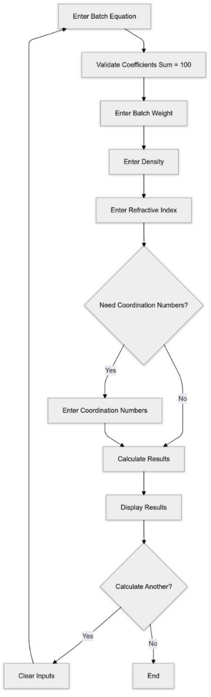

# Summary

Glass formulation requires calculations of raw material proportions as well as the resulting physical and optical properties. Manual calculations are often tedious and prone to errors.  
**Glass Properties Calculator** is an open-source Python application with a simple user interface, making it accessible to beginners and non-technical users. It provides a wide range of outputs to better understand the physical and optical properties of glass. Key features include input options for density, refractive index, and coordination numbers, enabling calculations such as molar volume and metal–metal separation. Additionally, it includes features for analyzing rare-earth metal effects, enhancing our understanding of glass behavior in both production and research. The calculator allows users to input relevant data, such as the batch equation and batch weight, and produces detailed outputs. Its straightforward design supports easy resetting and repetition of calculations, making it an essential tool for accurate glass composition analysis and production.  

The software is available both as Python source code and as a standalone Windows executable, making it accessible to researchers and students without programming expertise.

# Statement of need

Optical properties are critical in fields such as photonics, telecommunications, and high-precision optics, while physical properties are important for engineering applications like construction and aerospace. Accurate calculations are essential for quality control and material selection. Manual calculations are slow and prone to errors, which may lead to significant changes in optical and physical behavior. Adjusting optical properties as required is an iterative process, and manually performing iterative calculations is not practical.  

Many of the existing tools are either closed-source or require programming skills to use. In addition, very few tools provide both physical and optical properties in a single software package. **Glass Properties Calculator** is an open-source, user-friendly application designed to fill these gaps. Even beginners with little to no technical knowledge can use it with ease.

# Functionality

**Inputs:**  
- Batch equation (coefficients summing to 100)  
- Batch weight  
- Glass density  
- Refractive index  
- Optional: coordination numbers of oxides  

**Outputs:**  
- Raw and derived masses of compounds  
- Weight fractions and gravimetric factors  
- Molar volume, metal–metal separations, packing density, oxygen packing density  
- Average coordination number and bonds per unit volume  
- Rare-earth element effects  
- Optical properties: polarizability, dielectric constants, and optical basicity  

**Implementation:**  
- Developed in Python using `Tkinter` (GUI) and `Chempy` (chemical computations).  
- Distributed as both source code and a precompiled `.exe`.  
- Accessible at: [Batch Calculator Website](https://batch-calculator.vercel.app/).  

# Figures

{ width=60% }

# Acknowledgements

We thank our colleagues and institutions who supported the development of this tool. Funding sources (if any) should be acknowledged here.
